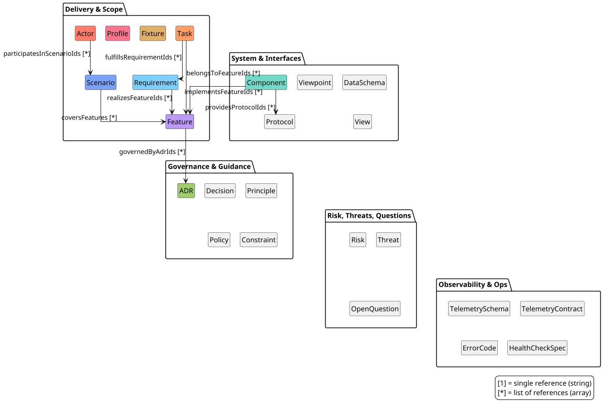

# SDD Bundle Editor – Implementation Tracker

This file tracks **active and planned** implementation work only.

For completed work and architecture, see:
- **[ARCHITECTURE.md](./ARCHITECTURE.md)** – Core concepts, package structure, design decisions
- **[AGENTS.md](./AGENTS.md)** – Developer/agent operational guide
- **[packages/mcp-server/README.md](./packages/mcp-server/README.md)** – MCP server documentation

---

## Completed Work Summary

The following major milestones have been completed:

| Phase | Description |
|-------|-------------|
| 0-7 | Monorepo, core packages, CLI, backend, UI, testing |
| 8.1 | Conversational agent interface with speech-to-text |
| 8.3 | Change proposal/application workflow |
| 8.4 | Read-only UI mode |
| 8.6 | Testing and documentation |
| 8.8 | MCP server with tools and resources |
| 8.9 | Conformance testing (Profile rules, audit templates) |
| Infra | External bundle repository migration |

**Current state**: Full read-only UI with MCP-based AI integration. All modifications via `apply_changes` MCP tool.

---

## In Progress

### Agent Backend Implementations

- [x] `CliAgentBackend` – Spawns CLI agent process (stdin/stdout)
- [x] `HttpAgentBackend` – Calls external HTTP API (DeepSeek, OpenAI, etc.)
- [ ] `VsCodeAgentBackend` – Communicates with VS Code's integrated agent
- [ ] `McpAgentBackend` – Uses MCP for agent communication

---

## Future Work

### Richer Example Bundles
- [ ] Protocol spec bundle (e.g., EC-OPRF/FHE-style)
- [ ] Feature-based project bundle (e.g., EUDIW simulator)

### VS Code Integration
- [ ] VS Code extension for tighter agent integration than web UI

### MCP Enhancements
- [ ] Additional prompts for specialized workflows
- [ ] Cross-bundle relationship analysis
- [ ] Resource template completions (autocomplete for bundleId, entityType, id)
- [ ] Prompt argument completions using `completable()` wrapper

### Schema Validation
- [x] ~~Redundant bidirectional link detection~~ – Done in `core-lint` package
  - Rule type: `redundant-bidirectional-link` 
  - Detects when A→B and B→A both exist in refGraph
  - Configurable via lint config with warning severity

### Schema Filtering & Display Logic
- [ ] Extract schema filtering to shared utility
  - **Current**: `createFilteredSchema` and `schemaWithoutHeaderFields` inline in EntityDetails.tsx
  - **Target**: `packages/ui-shell/src/utils/schemaFiltering.ts`
  - **Functions**:
    - `filterSchemaForLayoutGroup(schema, groupKey, headerFieldNames)` - returns filtered schema for a layout group
    - `filterSchemaWithoutHeaderFields(schema, headerFieldNames)` - removes header-only fields from schema
    - `getHeaderFieldNames(schema)` - extracts field names where `x-sdd-displayLocation === 'header'`
  - **Benefit**: Testable in isolation, reusable in other components

- [ ] Add unit tests for schema filtering logic
  - **Location**: `packages/ui-shell/src/utils/__tests__/schemaFiltering.test.ts`
  - **Test cases**:
    - Header fields are never included in filtered schemas
    - Fields without layout group don't appear in any group
    - Fields with layout group only appear in their assigned group
    - `additionalProperties: false` is always set in output
    - Order is preserved by `x-sdd-order`
  - **Effort**: 30 min
  - **Impact**: Prevents regressions in schema-driven UI filtering

### Entity Relationship Graph Visualization
- [ ] Interactive graph view for entity types and relationships
  - **Tab**: New "🗺️ Relationship Map" tab in BundleOverview
  - **Library**: React Flow + dagre layout (recommended)
  - **Nodes**: Entity types with colors from bundle-type config
  - **Edges**: Relationships with labels (field name + cardinality)
  - **Clustering**: Group nodes by category (already implemented in bundle-type.json)
  - **Interactions**:
    - Click node → navigate to entity type in sidebar
    - Click edge → show relationship details tooltip
    - Pan/zoom with minimap
    - Optional: drag nodes to customize layout
  - **Effort**: ~3 days for production-ready feature

Reference PlantUML Diagram (click to expand)

