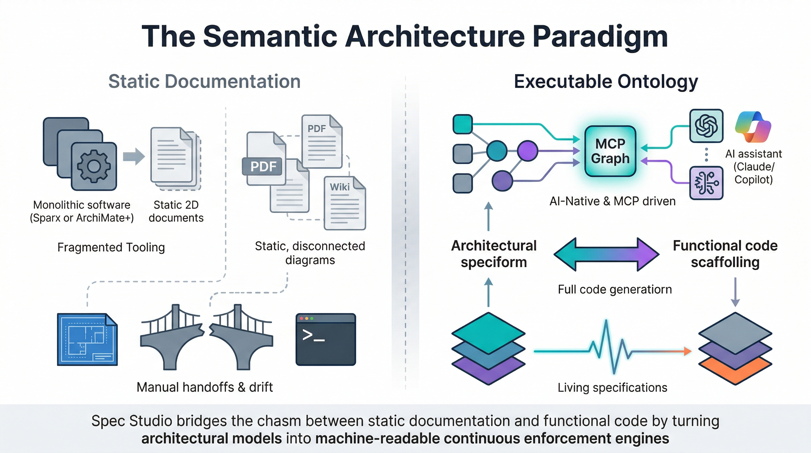
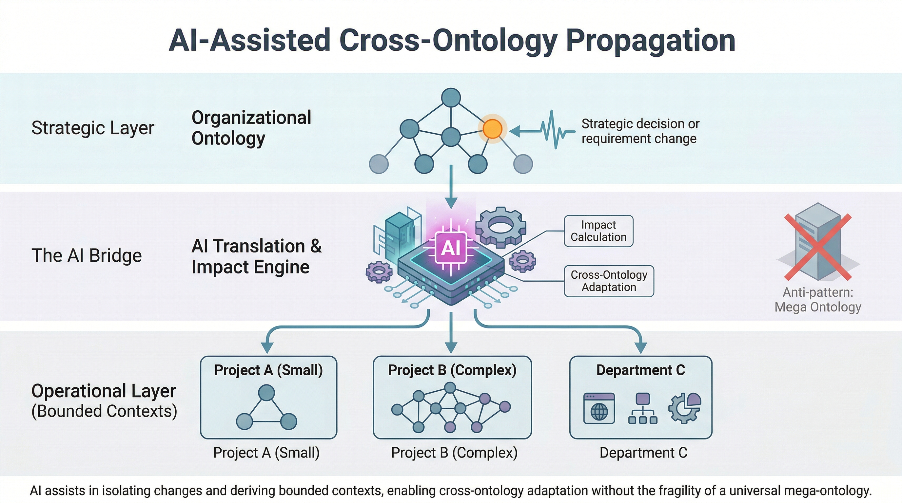
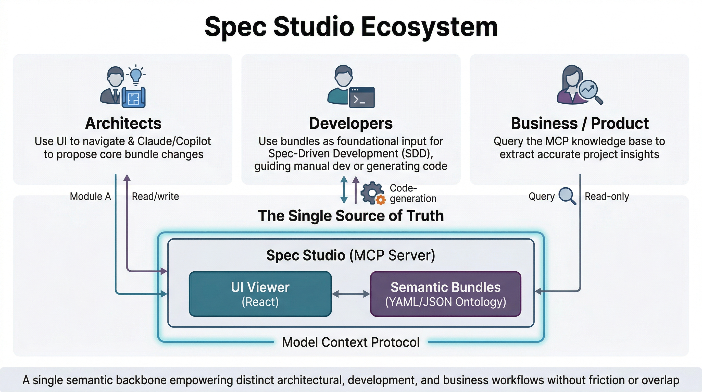
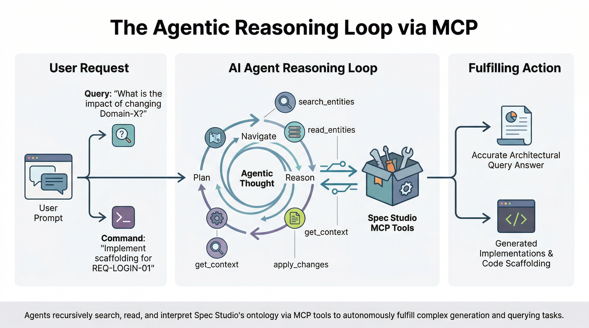

# Spec Studio: The Semantic Architecture IDE



**Spec Studio** is an open-source IDE for **Ontology-Driven Software Engineering (ODSE)**. It allows engineering domains to formally capture their systems, requirements, boundaries, and business logic into an executable Enterprise Knowledge Graph—turning static architectural models (like TOGAF or C4) into machine-readable constraints and relationships.

Traditional architecture documentation is passive. Spec Studio implements **Spec-Driven Engineering**: your architectural boundaries, API contracts, and decision records (ADRs) become the execution constraints for your CI/CD pipelines and AI agents, effectively building an **Organizational Brain**.

### The Way of Working

Spec Studio is built from the ground up for the AI era, treating LLMs as first-class citizens:

1. **AI-Native Tooling (MCP Server):** Spec Studio ships with a built-in Model Context Protocol (MCP) server. AI assistants (like Claude Desktop or GitHub Copilot) can be simply plugged right in.
2. **Conversational Updates:** Instead of manually formatting dense YAML/JSON files, users can just converse with the AI to update the organizational ontology seamlessly via the MCP interface.
3. **Executable Specifications:** Because the ontology is formally captured in isolated "Bundles" (Acting as Domain-Driven Bounded Contexts), down-stream implementation code can be generated directly from the ontology.
4. **Visual Knowledge Graph Viewer:** You don't have to manually traverse your project to discover its context. Spec Studio includes a rich, read-only visual UI to instantly view what's going on in the knowledge graph.

### Current Status

*Actively iterating on the core semantic engine, UI schemas, and MCP integrations. Spec Studio can already be used to generate code—MCP tooling (via clients like Claude Desktop or GitHub Copilot) can read requirements, specifications, and API specs directly from the federated bundles to scaffold immediate implementations.*

---

## Cross-Ontology Propagation



Spec Studio avoids the anti-pattern of a universal "Mega Ontology". Instead, we enforce **Federated Bounded Contexts**. AI assistants bridge the gap, taking strategic-level decisions from the organizational ontology and translating/propagating them as constraints into the correct specific project ontologies without brittle hardcoding.

---

## Architecture & Persona Interactions



- **Architects**: Navigate definitions visually using the UI, and use Claude/Copilot to propose architectural changes to the bundle.
- **Developers**: Utilize entities across one or more specification bundles as the foundational input for **Spec-Driven Development (SDD)**. The bundles act as strict architectural guardrails to guide manual development, or they can be consumed by AI agents to autonomously generate downstream implementation code.
- **Business/Product**: Interrogate the knowledge graph (e.g., via ChatGPT connected to the MCP Server) to ask plain English questions about system requirements and project status.

---

## The Agentic Reasoning Loop



AI assistants do not just answer simple questions—they process your architecture through an **Agentic Reasoning Loop**. When an architect asks a strategic question or a developer requests a scaffolding implementation, the AI recursively interacts with Spec Studio's MCP interface (using tools like `search_entities` and `get_context`) to evaluate constraints and safely autonomously complete complex tasks.

---

## Quick Start

### Running with Docker (Recommended)

You can build and run Spec Studio locally using Docker. This creates a self-contained environment with both the API and Web UI running on port 8080.

```bash
# Build the container
docker build -t spec-studio .

# Run the container
docker run -p 8080:8080 spec-studio
```
Then navigate to `http://localhost:8080` in your browser.

### Manual Setup (For Development)

- Node.js 18+.
- `pnpm` (recommended; see `package.json#packageManager`).
- Git (required for AI flows, which enforce Git discipline).

```bash
pnpm install
```

### Build and test

From the repo root:

```bash
pnpm build
pnpm test
```

This runs `tsc` and `vitest` across all workspaces.

---

## MCP Server (AI Integration)

The project uses an **MCP-first architecture** where all bundle modifications are done via the MCP Server, accessible to AI assistants like GitHub Copilot and Claude Desktop.

### Available Tools

| Tool | Description |
|------|-------------|
| `list_bundles` | List all loaded bundles |
| `read_entities` | Read one or more entities by type and IDs |
| `list_entities` | List all entity IDs |
| `get_context` | Get entity with all related dependencies |
| `get_conformance_context` | Get conformance rules and audit templates from a Profile |
| `search_entities` | Search across all bundles |
| `validate_bundle` | Validate and return diagnostics |
| `apply_changes` | **Atomic batch changes** (create/update/delete with validation) |

### Configuration

**VS Code + GitHub Copilot** - Create `.vscode/mcp.json`:

```json
{
  "servers": {
    "sdd-bundle": {
      "type": "stdio",
      "command": "node",
      "args": [
        "/home/ivan/dev/sdd-bundle-editor/packages/mcp-server/dist/index.js",
        "/path/to/your/bundle"
      ]
    }
  }
}
```

Then in Copilot Chat (Agent Mode), use `#apply_changes`, `#read_entities`, etc.

**Claude Desktop** - Add to `~/.config/claude/claude_desktop_config.json`:

```json
{
  "mcpServers": {
    "sdd-bundle": {
      "command": "node",
      "args": [
        "/home/ivan/dev/sdd-bundle-editor/packages/mcp-server/dist/index.js",
        "/path/to/your/bundle"
      ]
    }
  }
}
```

See [`packages/mcp-server/README.md`](packages/mcp-server/README.md) for full documentation.

---

## CLI usage

The CLI is defined in `packages/cli` and exposed as `sdd-bundle`.

From the repo root (after `pnpm install`):

```bash
pnpm --filter @sdd-bundle-editor/cli build
node packages/cli/dist/index.js validate --bundle-dir /home/ivan/dev/sdd-sample-bundle --output json
```

Or, if you wire it into `pnpm` bins:

```bash
sdd-bundle validate --bundle-dir $SDD_SAMPLE_BUNDLE_PATH --output json
```

### Commands

- `sdd-bundle validate [--bundle-dir DIR] [--output json|text]`
  - Loads the bundle.
  - Runs schema + lint + gate checks.
  - Exit code 0 on success, 1 on any `error` severity diagnostic.
- `sdd-bundle report-coverage [--bundle-dir DIR] [--output json|text]`
  - Uses bundle‑type `relations` + ref graph to report coverage metrics.
- `sdd-bundle generate [...]`
  - Stubbed AI entrypoint using the no‑op provider (no writes yet).

---

## External Bundle Setup

SDD bundles are maintained in separate repositories. The sample bundle is at `/home/ivan/dev/sdd-sample-bundle`:

- `sdd-bundle.yaml` – manifest.
- `schemas/*.schema.json` – document schemas for `Feature`, `Requirement`, `Task`, etc.
- `bundle/features/FEAT-001.yaml` – a single feature.
- `bundle/requirements/REQ-001.yaml` – a requirement linked to the feature.
- `bundle/tasks/TASK-001.yaml` – a task linked to the requirement and feature.
- `config/sdd-lint.yaml` – lint rules (title capitalization, has‑link coverage).

**Configuration**: Set the `SDD_SAMPLE_BUNDLE_PATH` environment variable to point to your bundle location, or pass `bundleDir` parameter to CLI/UI.

---

## Development Workflow

### Monorepo layout

- `packages/core-schema` – JSON Schema loading/compilation and validation (Ajv, custom `sdd-ref` format).
- `packages/core-model` – bundle manifest/entity loading, ID registry, reference graph, validation pipeline.
- `packages/core-lint` – lint engine (`regex`, `has-link`, `coverage`) on top of the core model.
- `packages/git-utils` – shared Git helpers (repo detection, branch, clean working tree).
- `packages/ui-shell` – React UI components and app shell (used by `apps/web`).
- `packages/mcp-server` – MCP server for AI assistants and web UI.
- `packages/cli` – `sdd-bundle` CLI for validation and coverage reporting.
- `apps/web` – React SPA that uses MCP server for all data operations.

### Running the Full Stack

From the repo root, run:

```bash
pnpm dev
```

This starts **three concurrent processes**:
- **[mcp]** (magenta) – MCP server (port 3001)
- **[web]** (green) – Webpack dev server for the UI
- **[ui-shell]** (yellow) – TypeScript compiler in watch mode

**Alternative (MCP server only):**
```bash
pnpm dev:mcp-only
```

### Read-Only UI

The UI is a **read-only viewer** for browsing and inspecting bundles:

1. **Navigate**: Browse entities by type in the sidebar
2. **View Details**: See entity data, references, and diagnostics
3. **Validate**: Click "Compile Spec" to run validation

To **modify** bundles, use MCP tools via Claude Desktop, GitHub Copilot, or curl to the HTTP endpoint.

### Keyboard Shortcuts

- **`Ctrl+B` / `Cmd+B`** - Toggle Sidebar
- **`Ctrl+P` / `Cmd+P`** - Quick Search
