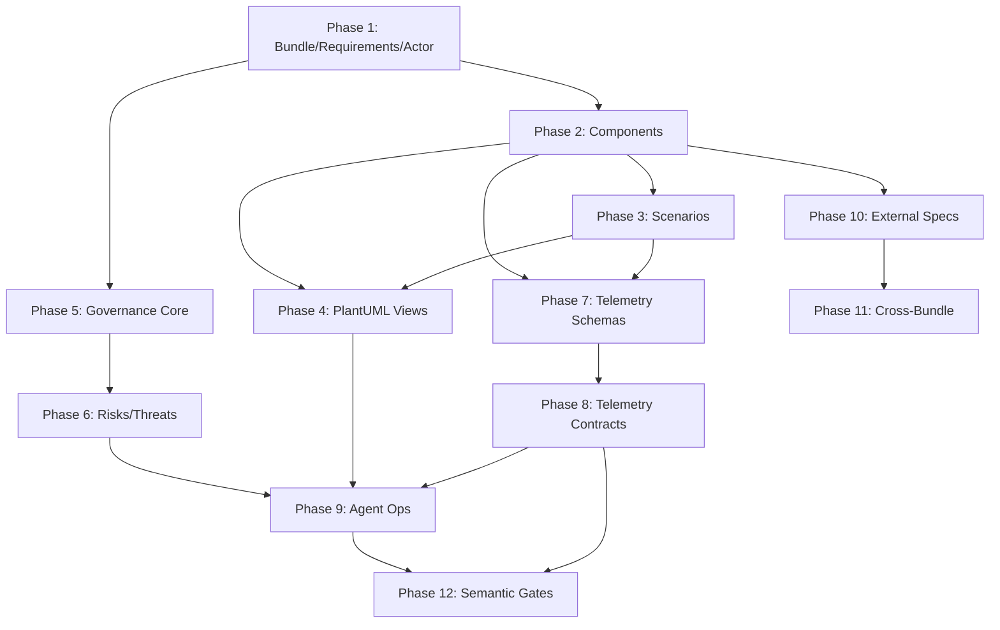

# SDD Bundle Editor Vision Roadmap

## User Decisions

| Decision | Choice |
|----------|--------|
| Priority order | **Dependency-based** |
| Cross-bundle | **Defer** to later phases |
| PlantUML diagrams | **High priority** (Phase 4) |
| Telemetry depth | **Full OTel** semantic conventions |
| Sample bundles | **One super-rich** bundle |
| Actor entity | **Yes** - for scenarios + requirement ownership |
| Threat modeling | **Yes** - STRIDE-style threats |
| Requirement taxonomy | **Explicit kind** + category + subtype |
| Requirement quality | **Lint rules** for quality assessment |

---

## Entity Count: 23 (was 21)

**New entities added:**
- `actor` (#8) - human/system roles for scenarios and requirement ownership  
- `threat` (#14) - STRIDE-style threat modeling with assets and attack surfaces

**Enhanced entities:**
- `requirement` - added kind, category, subtype, state, owner_id, quality_attributes, mitigates_threats

---

## Approach: Learn by Doing

Execute phases incrementally with optional refinement checkpoints:

1. **Implement Phase N** (implementation plan → code → tests)
2. **After completion**: Optional schema/vision refinement if surprises emerged
3. **Continue to Phase N+1**

This keeps momentum while allowing course correction.

---

## 12-Phase Roadmap

### Phase 1: Foundation – Enhanced Bundle & Requirement Model
- Extend `Bundle` with version, owners, tags
- Implement requirement taxonomy:
  - `kind`: functional | non_functional | constraint
  - `category`: FR/NFR/SEC/OBS/PRV/CPL/DATA/UX/OPS/NG
  - `subtype`: interface | performance | latency | physical | design_constraint
- Add `state`, `owner_id`, `parent_id`, `quality_attributes`
- Add `actor` entity (human/system/external)
- Add requirement quality lint rules (atomic, cohesive, complete, traceable, verifiable)
- **Update sample bundle**

**Complexity**: Medium | **Dependencies**: None

---

### Phase 2: Component & Protocol Layer
- Add `component` entity (service/UI/worker/external_system/adapter/library)
- Add `protocol` entity (http-rest/graphql/grpc/messaging/cli)
- Add `data_schema` entity
- Implement component↔protocol relations
- **Update sample bundle**

**Complexity**: Medium | **Dependencies**: Phase 1

---

### Phase 3: Scenario Unification
- Add `scenario` entity with `viewpoint: ui | api | e2e-test | perf-test`
- Add `actor_id` to scenario steps (who performs the action)
- Implement scenario steps with component/protocol/data_schema refs
- Refine `fixture` entity
- Implement scenario↔requirement traceability
- **Update sample bundle**

**Complexity**: Medium | **Dependencies**: Phase 2

---

### Phase 4: Views & Viewpoints – PlantUML Diagrams ⬆️ HIGH PRIORITY
- Add `viewpoint` entity (diagram template)
- Add `view` entity (concrete diagram with PlantUML)
- Implement viewpoints: C4 context, API sequence, component dependency
- PlantUML generation using `tools/plantuml/`
- View↔entity reference tracking
- **Update sample bundle**

**Complexity**: Medium-High | **Dependencies**: Phase 2, Phase 3

---

### Phase 5: Governance – Principles, Policies, Constraints
- Add `principle` entity
- Add `policy` entity with categories
- Add `constraint` entity with severity
- Cross-references to requirements, components
- **Update sample bundle**

**Complexity**: Low-Medium | **Dependencies**: Phase 1

---

### Phase 6: Governance – Risks, Threats, Questions
- Add `risk` entity
- Add `threat` entity (STRIDE categories, attack surfaces, assets)
- Add `open_question` entity (optional)
- Implement threat↔requirement relations (mitigates_threats)
- Risk↔threat↔ADR relations
- **Update sample bundle**

**Complexity**: Medium | **Dependencies**: Phase 5

---

### Phase 7: Observability – Telemetry Schemas (Full OTel)
- Add `telemetry_schema` entity (trace/metric/log/event)
- Full OTel semantic conventions:
  - Span names, types, attributes with semantic_convention_ref
  - Attribute types, required flags
  - W3C headers (traceparent/tracestate/baggage)
- Telemetry↔component, telemetry↔protocol relations
- **Update sample bundle**

**Complexity**: High | **Dependencies**: Phase 2, Phase 3

---

### Phase 8: Observability – Telemetry Contracts & Error Codes
- Add `telemetry_contract` entity
- Add `error_code` entity (HTTP status, Problem Details)
- Add `health_check_spec` entity
- Contract↔scenario, error↔telemetry relations
- **Update sample bundle**

**Complexity**: Medium | **Dependencies**: Phase 7

---

### Phase 9: Agent Operations Enhancement
- Traceability analysis, coverage checking
- Telemetry schema generation from scenarios
- Diagram generation/refresh
- Governance gap analysis
- Threat coverage validation

**Complexity**: High | **Dependencies**: Phase 1-8

---

### Phase 10: External Spec References
- Add `external_spec_ref` entity
- Spec type detection (openapi3/asyncapi2/protobuf/graphql)
- Location/version/hash tracking
- Reverse engineering: OpenAPI → protocol + data_schema

**Complexity**: High | **Dependencies**: Phase 2

---

### Phase 11: Cross-Bundle Dependencies (DEFERRED)
- Add `cross_bundle_dependency` entity
- Bundle ID + version + element ID references
- Drift detection
- API for external bundle pull/compare

**Complexity**: High | **Dependencies**: Phase 2, Phase 10

---

### Phase 12: Semantic Gates & CI Integration
- Semantic gate rules for telemetry contracts
- CI-friendly validation commands
- OTel trace validation
- Coverage reporting (requirements → scenarios → tests)
- Threat mitigation coverage

**Complexity**: Medium | **Dependencies**: Phase 8, Phase 9

---

## Dependency Graph

---

## Sample Bundle Evolution

| Phase | Additions |
|-------|-----------|
| 1 | Categorized requirements (kind/category/subtype), actors |
| 2 | Components, protocols, data schemas |
| 3 | UI/API/E2E scenarios with actor steps, fixtures |
| 4 | PlantUML views (C4, sequence diagrams) |
| 5-6 | Principles, policies, constraints, risks, threats |
| 7-8 | Telemetry schemas, contracts, error codes |
