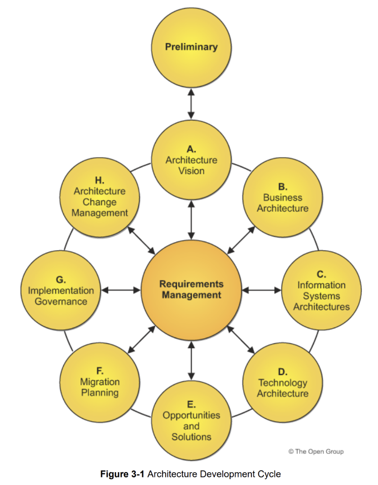
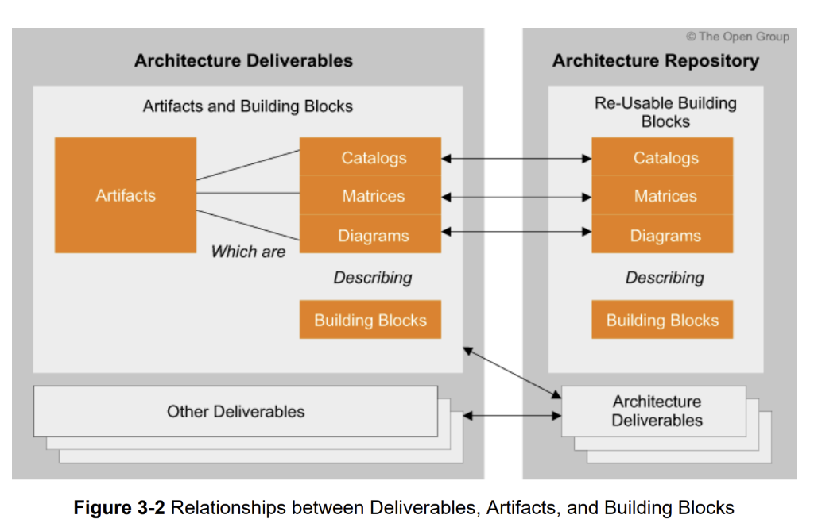
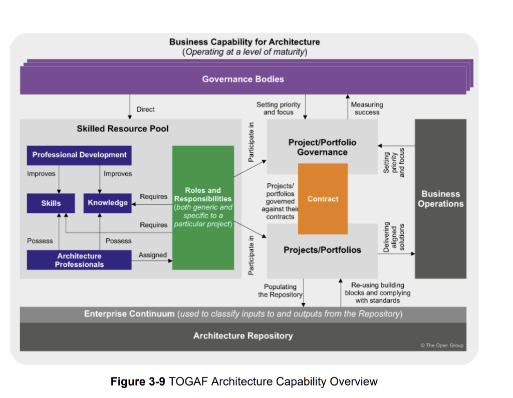
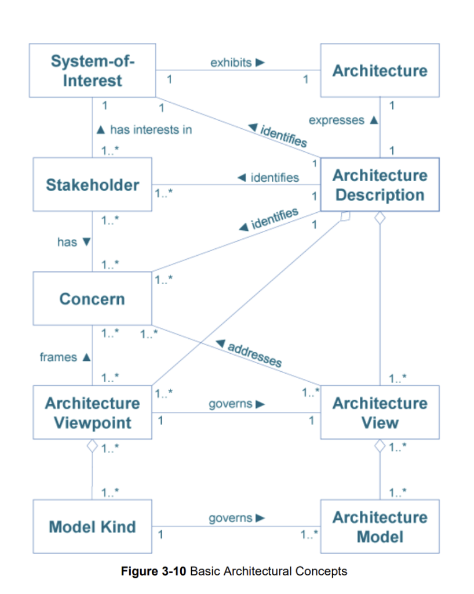

# TOGAF 10 Key Diagrams

Key conceptual diagrams from the TOGAF® Standard, 10th Edition for reference.

---

## Figure 3-1: Architecture Development Cycle (ADM)



The **Architecture Development Method (ADM)** is the core of TOGAF. It's an iterative cycle with the following phases:

| Phase | Name | Purpose |
|-------|------|---------|
| **Preliminary** | Framework & Principles | Prepare organization for architectural work |
| **A** | Architecture Vision | Set scope, constraints, and expectations |
| **B** | Business Architecture | Develop business architecture baseline and target |
| **C** | Information Systems Architectures | Develop data and application architectures |
| **D** | Technology Architecture | Develop technology architecture |
| **E** | Opportunities and Solutions | Identify delivery approach, major work packages |
| **F** | Migration Planning | Prioritize projects, develop migration roadmap |
| **G** | Implementation Governance | Provide oversight during implementation |
| **H** | Architecture Change Management | Manage changes to the architecture |
| **Center** | Requirements Management | Continuous throughout all phases |

### Key Characteristics
- **Iterative**: Phases can be revisited as needed
- **Cyclical**: Continuous improvement rather than one-time effort
- **Requirements-Centric**: Requirements management is central to all phases

---

## Figure 3-2: Relationships between Deliverables, Artifacts, and Building Blocks



This diagram shows the relationship between three fundamental TOGAF concepts:

### Architecture Deliverables
Contractually specified work products containing:
- **Artifacts** - Architectural work products
- **Building Blocks** - Reusable components

### Artifact Types
| Type | Description | Examples |
|------|-------------|----------|
| **Catalogs** | Lists/inventories | Application Portfolio, Technology Standards |
| **Matrices** | Relationship mappings | App/Data Matrix, Service/Function Matrix |
| **Diagrams** | Visual representations | Capability Map, Deployment Diagram |

### Architecture Repository
Contains **Re-Usable Building Blocks**:
- Stored Catalogs, Matrices, Diagrams
- Architecture Deliverables (archived)
- Standards and reference materials

### Key Relationships
```
Artifacts ──contain──► Catalogs, Matrices, Diagrams
Artifacts ──describe──► Building Blocks
Deliverables ──flow to──► Repository
Repository ──provides──► Re-usable Building Blocks
```

---

## Figure 3-9: TOGAF Architecture Capability Overview



This diagram shows the **Business Capability for Architecture** operating at a level of maturity:

### Governance Layer
- **Governance Bodies** - Direct the architecture capability

### Skilled Resource Pool
| Component | Description |
|-----------|-------------|
| **Professional Development** | Improves Skills and Knowledge |
| **Skills** | Technical and soft skills possessed by architects |
| **Knowledge** | Domain and framework knowledge |
| **Architecture Professionals** | The people who possess Skills and Knowledge |
| **Roles and Responsibilities** | Both generic and project-specific |

### Governance & Operations
| Component | Description |
|-----------|-------------|
| **Project/Portfolio Governance** | Sets priority and focus, measures success |
| **Contract** | Governs projects/portfolios |
| **Projects/Portfolios** | Participate in governance, deliver solutions |
| **Business Operations** | Receives aligned solutions |

### Foundation Layer
| Component | Description |
|-----------|-------------|
| **Enterprise Continuum** | Classifies inputs to and outputs from Repository |
| **Architecture Repository** | Stores all architectural assets |

### Key Flows
- Projects populate the Repository
- Projects re-use building blocks and comply with standards
- Governance bodies set priority and measure success
- Business operations receive aligned solutions

---

## Figure 3-10: Basic Architectural Concepts



This is a **UML-style metamodel** showing the core architectural concepts and their relationships:

### Entities

| Entity | Description |
|--------|-------------|
| **System-of-Interest** | The system being architected |
| **Architecture** | Fundamental properties of the system |
| **Architecture Description** | Documentation expressing the architecture |
| **Stakeholder** | Individual/group with interest in the system |
| **Concern** | Interest relevant to stakeholders |
| **Architecture Viewpoint** | Specification for a type of view |
| **Architecture View** | Representation from a perspective |
| **Model Kind** | Conventions for modeling |
| **Architecture Model** | Representation of a subject of interest |

### Relationships (with Cardinality)

| Relationship | From → To | Cardinality |
|--------------|-----------|-------------|
| `exhibits` | System-of-Interest → Architecture | 1:1 |
| `expresses` | Architecture Description → Architecture | 1:1 |
| `identifies` | Architecture Description → Stakeholder | 1:1..* |
| `identifies` | Architecture Description → Concern | 1:1..* |
| `has interests in` | Stakeholder → System-of-Interest | 1..*:1 |
| `has` | Stakeholder → Concern | 1..*:1..* |
| `frames` | Concern → Architecture Viewpoint | 1..*:1..* |
| `addresses` | Architecture View → Concern | 1..*:1..* |
| `governs` | Architecture Viewpoint → Architecture View | 1:1..* |
| `governs` | Model Kind → Architecture Model | 1:1..* |
| (aggregation) | Architecture Viewpoint ◇─ Model Kind | 1:1..* |
| (aggregation) | Architecture View ◇─ Architecture Model | 1:1..* |
| (aggregation) | Architecture Description ◇─ Architecture View | 1:1..* |

### Diagram Interpretation

```
System-of-Interest ──exhibits──► Architecture
                                        │
                                 expresses▲
                                        │
                              Architecture Description ◇──► Architecture View
                                   │    │                         │ ◇
                         identifies│    │identifies         governs│ │
                                   ▼    ▼                          │ ▼
                             Stakeholder  Concern ◄──frames──── Architecture Model
                                   │         │                     ▲
                                   │ has     │addresses       governs│
                                   └────►────┘                      │
                                             │                 Model Kind
                                             ▼                      ▲
                                    Architecture Viewpoint ◇────────┘
```

### Key Insights for SDD Bundle Design

This metamodel suggests additional entity types for a comprehensive EA bundle:

1. **View/Viewpoint Pattern**: Architecture views are governed by viewpoints
2. **Concern-Centric**: Views address stakeholder concerns
3. **Model Composition**: Views contain models, viewpoints reference model kinds
4. **Stakeholder Traceability**: All architecture decisions trace back to stakeholder concerns

---

## Metamodel Summary for SDD Implementation

Based on these diagrams, a TOGAF SDD bundle could include:

### Core Entities (from Figure 3-10)
- `SystemOfInterest`
- `Architecture`
- `ArchitectureDescription`
- `Stakeholder`
- `Concern`
- `ArchitectureViewpoint`
- `ArchitectureView`
- `ModelKind`
- `ArchitectureModel`

### Artifact Entities (from Figure 3-2)
- `Artifact`
- `Catalog`
- `Matrix`
- `Diagram`
- `BuildingBlock`
- `Deliverable`

### ADM Phase Entities (from Figure 3-1)
- `Phase`
- `Requirement`
- `WorkPackage`
- `TransitionArchitecture`

### Capability Entities (from Figure 3-9)
- `GovernanceBody`
- `ArchitectureProfessional`
- `Role`
- `Skill`
- `Contract`
- `Project`
- `Portfolio`

---
