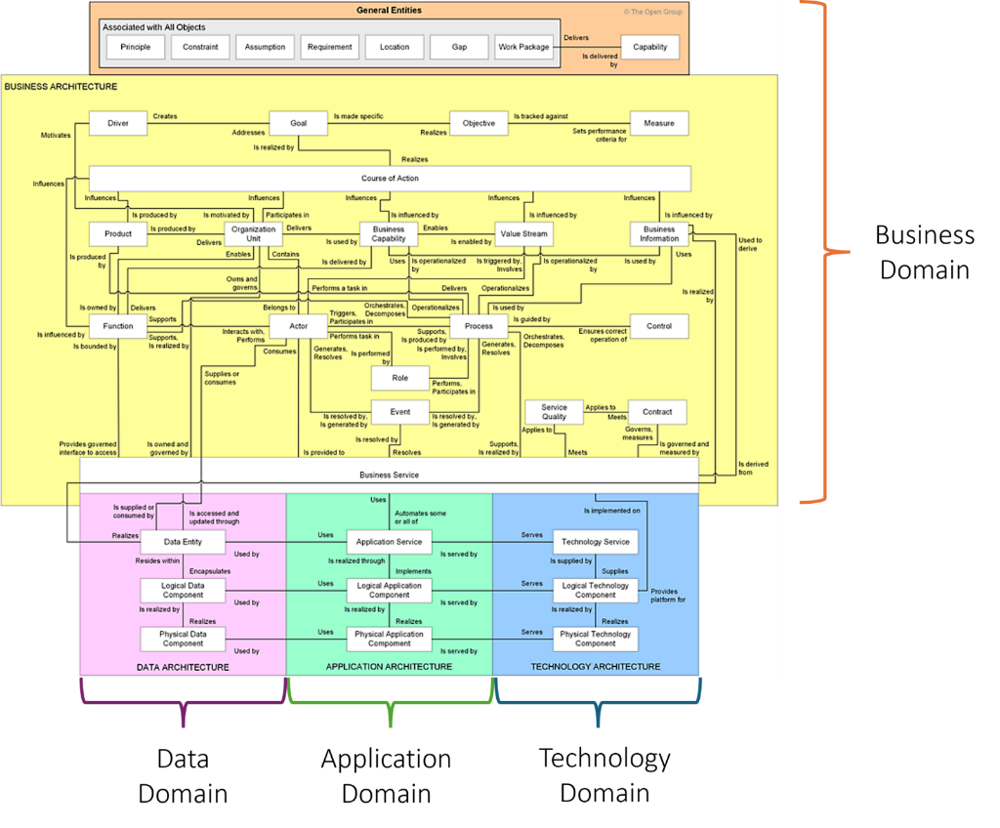

# TOGAF 10 Core Enterprise Metamodel

Complete extraction of the TOGAF 10 Core Enterprise Metamodel, including all entities and their relationships.

---

## Metamodel Diagram



---

## Entity Summary by Domain

### General Entities (Cross-Cutting)
*"Associated with All Objects"*

| Entity | Description |
|--------|-------------|
| **Principle** | General rules and guidelines for architecture work |
| **Constraint** | Limitation or restriction on the architecture |
| **Assumption** | Statement taken as true for planning purposes |
| **Requirement** | Statement of need that must be met |
| **Location** | Place where business activity occurs |
| **Gap** | Difference between baseline and target states |
| **Work Package** | Set of actions to achieve objectives |
| **Capability** | Ability that an organization possesses |

**Key Relationship:** Work Package `delivers` → Capability

---

### Business Architecture Domain

#### Motivation Layer

| Entity | Description |
|--------|-------------|
| **Driver** | External or internal condition that motivates action |
| **Goal** | High-level statement of intent or direction |
| **Objective** | Specific, measurable target supporting a goal |
| **Measure** | Quantifiable indicator for tracking objectives |
| **Course of Action** | Direction to achieve goals and objectives |

#### Organization Layer

| Entity | Description |
|--------|-------------|
| **Organization Unit** | Self-contained unit with goals and measures |
| **Actor** | Person, organization, or system with roles |
| **Role** | Expected behavior of an actor |
| **Function** | Business capability grouped by criteria |

#### Value Layer

| Entity | Description |
|--------|-------------|
| **Product** | Outcome offered to customers |
| **Business Capability** | Ability to achieve specific purpose |
| **Value Stream** | End-to-end value-creating activities |
| **Business Information** | Information used by the business |

#### Operations Layer

| Entity | Description |
|--------|-------------|
| **Process** | Sequence of activities producing outcome |
| **Event** | Occurrence that triggers or is triggered by processes |
| **Control** | Ensures correct operation of processes |
| **Business Service** | Encapsulated business behavior |
| **Service Quality** | Attributes of a service |
| **Contract** | Agreement governing service delivery |

---

### Data Architecture Domain

| Entity | Description |
|--------|-------------|
| **Data Entity** | Encapsulation of data recognized by business |
| **Logical Data Component** | Logical grouping of data entities |
| **Physical Data Component** | Physical implementation of data storage |

---

### Application Architecture Domain

| Entity | Description |
|--------|-------------|
| **Application Service** | Discrete behavior from an application |
| **Logical Application Component** | Logical grouping of application functionality |
| **Physical Application Component** | Physical implementation of application |

---

### Technology Architecture Domain

| Entity | Description |
|--------|-------------|
| **Technology Service** | Technical capability for infrastructure |
| **Logical Technology Component** | Logical grouping of technology |
| **Physical Technology Component** | Physical implementation of technology |

---

## Complete Entity List (44 Entities)

### General Entities (8)
1. Principle
2. Constraint
3. Assumption
4. Requirement
5. Location
6. Gap
7. Work Package
8. Capability

### Business Architecture Entities (18)
9. Driver
10. Goal
11. Objective
12. Measure
13. Course of Action
14. Organization Unit
15. Actor
16. Role
17. Function
18. Product
19. Business Capability
20. Value Stream
21. Business Information
22. Process
23. Event
24. Control
25. Business Service
26. Service Quality
27. Contract

### Data Architecture Entities (3)
28. Data Entity
29. Logical Data Component
30. Physical Data Component

### Application Architecture Entities (3)
31. Application Service
32. Logical Application Component
33. Physical Application Component

### Technology Architecture Entities (3)
34. Technology Service
35. Logical Technology Component
36. Physical Technology Component

---

## Relationships Extracted from Diagram

### General Entity Relationships

```
Work Package ──delivers──► Capability
```

### Business Architecture - Motivation

```
Driver ──creates──► Goal
Goal ──addresses──► [something]
Goal ──is made specific──► Objective
Objective ──realizes──► [Goal]
Objective ──is tracked against──► Measure
Measure ──sets performance criteria for──► [Objective]
Course of Action ──realizes──► Goal
Course of Action ──influences──► [multiple entities]
```

### Business Architecture - Organization

```
Organization Unit ──owns and governs──► [resources]
Organization Unit ──delivers──► Business Capability
Organization Unit ──contains──► [sub-units]
Product ──is produced by──► Organization Unit
Actor ──belongs to──► Organization Unit
Actor ──interacts with──► [entities]
Actor ──performs──► [tasks]
Actor ──consumes──► [services]
Role ──performs task in──► [context]
Role ──generates, resolves──► Event
Role ──is performed by──► Actor
Function ──delivers──► [outcomes]
Function ──supports──► [capabilities]
Function ──is influenced by──► [factors]
Function ──is bounded by──► [constraints]
Function ──is realized by──► [implementations]
```

### Business Architecture - Value

```
Business Capability ──enables──► Value Stream
Business Capability ──is used by──► [entities]
Business Capability ──uses──► [resources]
Business Capability ──is delivered by──► Organization Unit
Value Stream ──is enabled by──► Business Capability
Value Stream ──involves──► [participants]
Value Stream ──is operationalized by──► [processes]
Value Stream ──is triggered by──► [events]
Value Stream ──uses──► Business Information
Business Information ──is used by──► [entities]
Business Information ──used to derive──► [outputs]
Business Information ──is influenced by──► [factors]
Product ──is produced by──► [entities]
Product ──enables──► [capabilities]
```

### Business Architecture - Operations

```
Process ──is used by──► [entities]
Process ──is guided by──► Control
Process ──orchestrates, decomposes──► [sub-processes]
Process ──generates, resolves──► Event
Process ──supports, is produced by, involves──► [entities]
Control ──ensures correct operation of──► Process
Event ──is resolved by, is generated by──► [entities]
Event ──performs, participates in──► [activities]
Business Service ──is provided to──► [consumers]
Business Service ──resolves──► [requests]
Business Service ──supports, is realized by──► [implementations]
Business Service ──is derived from──► [sources]
Service Quality ──applies to──► Business Service
Service Quality ──meets──► Contract
Contract ──governs, measures──► [services]
Contract ──is governed and measured by──► [governance]
```

### Cross-Domain Relationships

#### Business → Data
```
Data Entity ──is supplied or consumed by──► [Business entities]
Data Entity ──is accessed and updated through──► [Business entities]
Function ──provides governed interface to access──► Data Entity
Business Service ──is owned and governed by──► [entities]
```

#### Data Architecture
```
Data Entity ──realizes──► [business concepts]
Logical Data Component ──resides within──► [context]
Logical Data Component ──encapsulates──► Data Entity
Logical Data Component ──is realized by──► Physical Data Component
Physical Data Component ──realizes──► Logical Data Component
Physical Data Component ──used by──► [applications]
```

#### Application Architecture
```
Application Service ──uses──► Data Entity
Application Service ──automates some or all of──► Business Service
Application Service ──is realized through──► Logical Application Component
Logical Application Component ──uses──► Logical Data Component
Logical Application Component ──implements──► Application Service
Logical Application Component ──is realized by──► Physical Application Component
Physical Application Component ──uses──► Physical Data Component
Physical Application Component ──realizes──► Logical Application Component
Physical Application Component ──is served by──► Technology Service
```

#### Technology Architecture
```
Technology Service ──serves──► Physical Application Component
Technology Service ──is implemented on──► [infrastructure]
Technology Service ──is supplied by──► Logical Technology Component
Logical Technology Component ──serves──► Logical Application Component
Logical Technology Component ──supplies──► Technology Service
Logical Technology Component ──is realized by──► Physical Technology Component
Logical Technology Component ──provides platform for──► [applications]
Physical Technology Component ──serves──► Physical Application Component
Physical Technology Component ──realizes──► Logical Technology Component
```

---

## Domain Color Coding

| Domain | Color | Entities |
|--------|-------|----------|
| **General** | Light Gray | Cross-cutting entities |
| **Business Architecture** | Yellow/Orange | Motivation, Organization, Value, Operations |
| **Data Architecture** | Purple | Data entities and components |
| **Application Architecture** | Green | Application services and components |
| **Technology Architecture** | Blue | Technology services and components |

---

## Abstraction Layers

The metamodel shows a clear abstraction pattern for IS/IT domains:

| Layer | Data | Application | Technology |
|-------|------|-------------|------------|
| **Conceptual** | Data Entity | Application Service | Technology Service |
| **Logical** | Logical Data Component | Logical Application Component | Logical Technology Component |
| **Physical** | Physical Data Component | Physical Application Component | Physical Technology Component |

Each layer follows the pattern:
- Logical `is realized by` → Physical
- Physical `realizes` → Logical
- Higher layer `uses` → Lower layer at same abstraction level

---

## Recommended SDD Bundle Structure

Based on this metamodel, the TOGAF 10 SDD bundle should include:

### Entity Categories

```yaml
categories:
  - name: General
    entities: [Principle, Constraint, Assumption, Requirement, Location, Gap, WorkPackage, Capability]
    
  - name: BusinessMotivation
    entities: [Driver, Goal, Objective, Measure, CourseOfAction]
    
  - name: BusinessOrganization
    entities: [OrganizationUnit, Actor, Role, Function]
    
  - name: BusinessValue
    entities: [Product, BusinessCapability, ValueStream, BusinessInformation]
    
  - name: BusinessOperations
    entities: [Process, Event, Control, BusinessService, ServiceQuality, Contract]
    
  - name: DataArchitecture
    entities: [DataEntity, LogicalDataComponent, PhysicalDataComponent]
    
  - name: ApplicationArchitecture
    entities: [ApplicationService, LogicalApplicationComponent, PhysicalApplicationComponent]
    
  - name: TechnologyArchitecture
    entities: [TechnologyService, LogicalTechnologyComponent, PhysicalTechnologyComponent]
```

### Key Relationship Patterns

1. **Motivation Chain:** Driver → Goal → Objective → Measure
2. **Capability Delivery:** Organization Unit → Business Capability → Value Stream
3. **Service Realization:** Business Service ← Application Service ← Technology Service
4. **Component Stack:** Logical Component → Physical Component
5. **Data Flow:** Data Entity ↔ Logical Data Component ↔ Physical Data Component

---

## Comparison with TOGAF 9.2

| Aspect | TOGAF 9.2 | TOGAF 10 |
|--------|-----------|----------|
| Total Entities | 35 (with extensions) | 36 core entities |
| Organization | Extension modules | Unified diagram |
| General Entities | Core module | "Associated with All Objects" |
| Abstraction Levels | Less explicit | Clear Logical/Physical pattern |
| Value Stream | Included | Prominent, connected to capabilities |
| Service Quality | Extension | Core entity |
| Contract | Extension | Core entity |

TOGAF 10 provides a more unified, visual metamodel while maintaining compatibility with 9.2 concepts.
