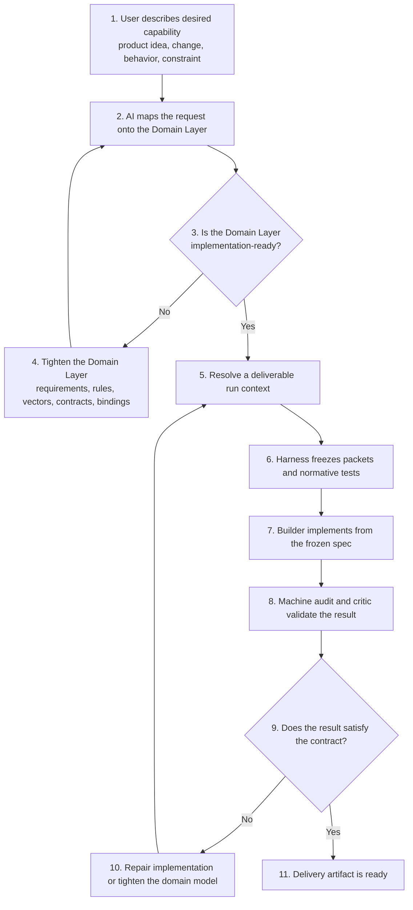
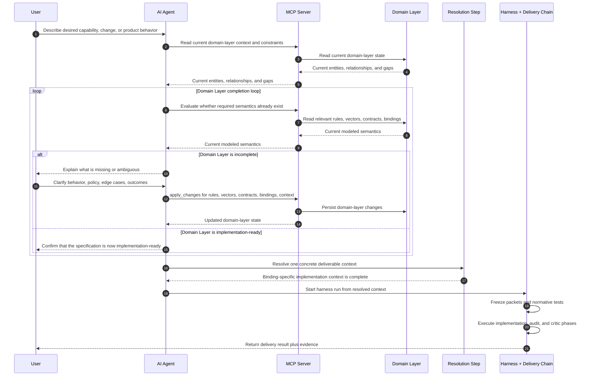
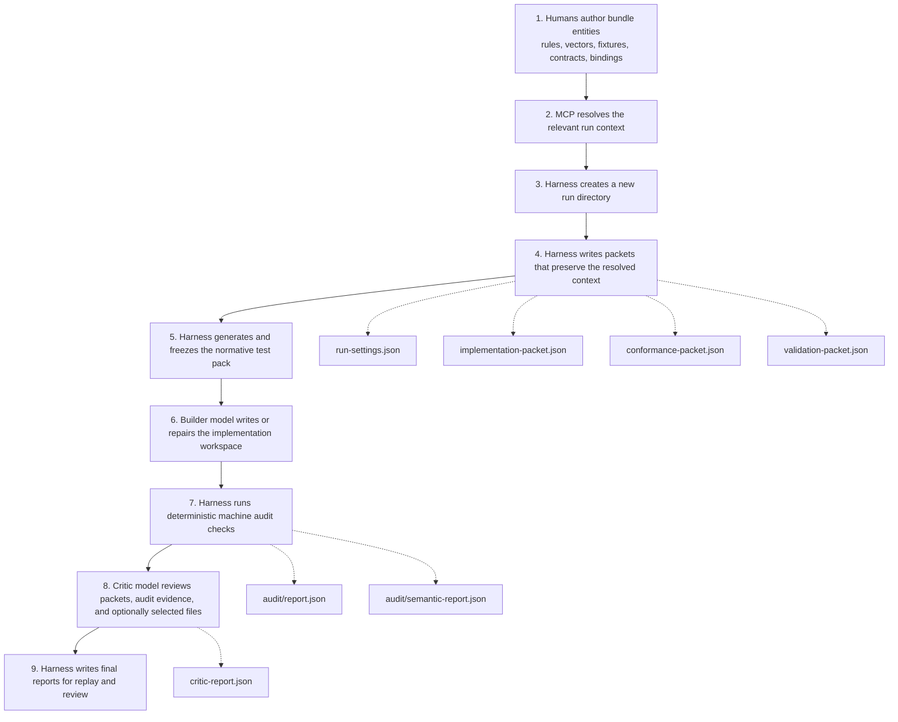
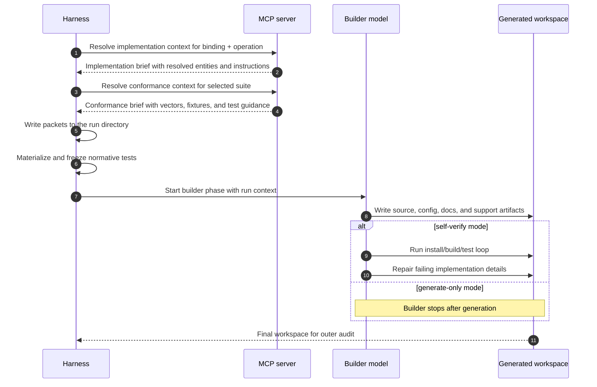
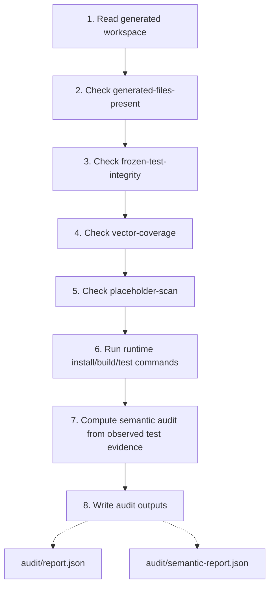
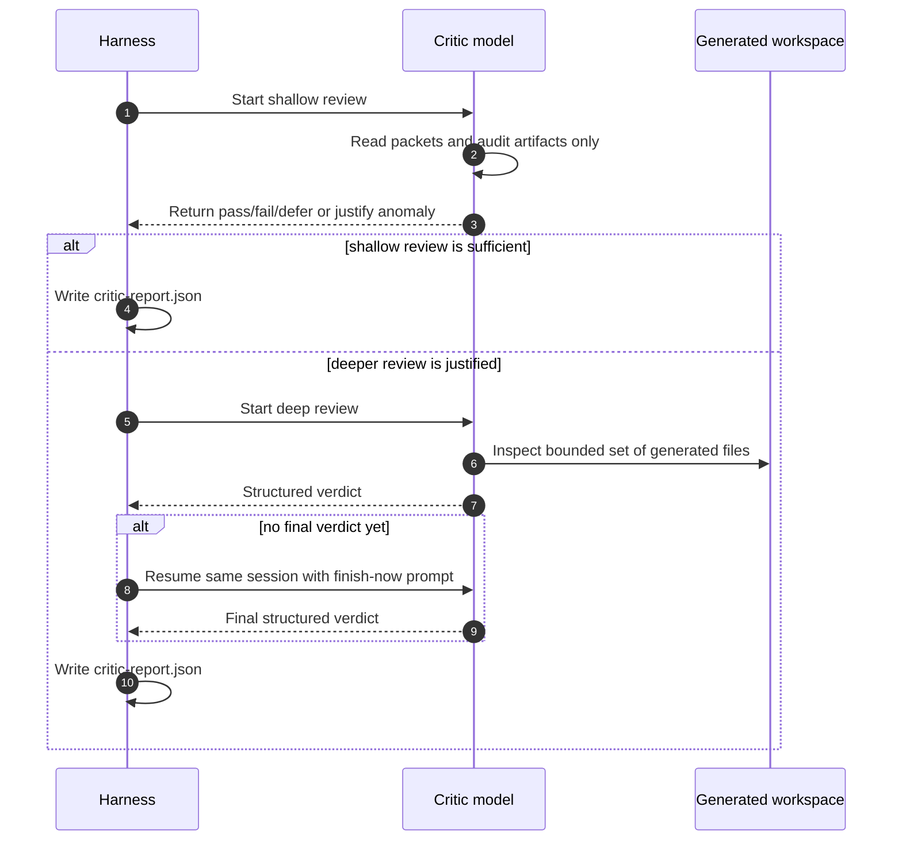
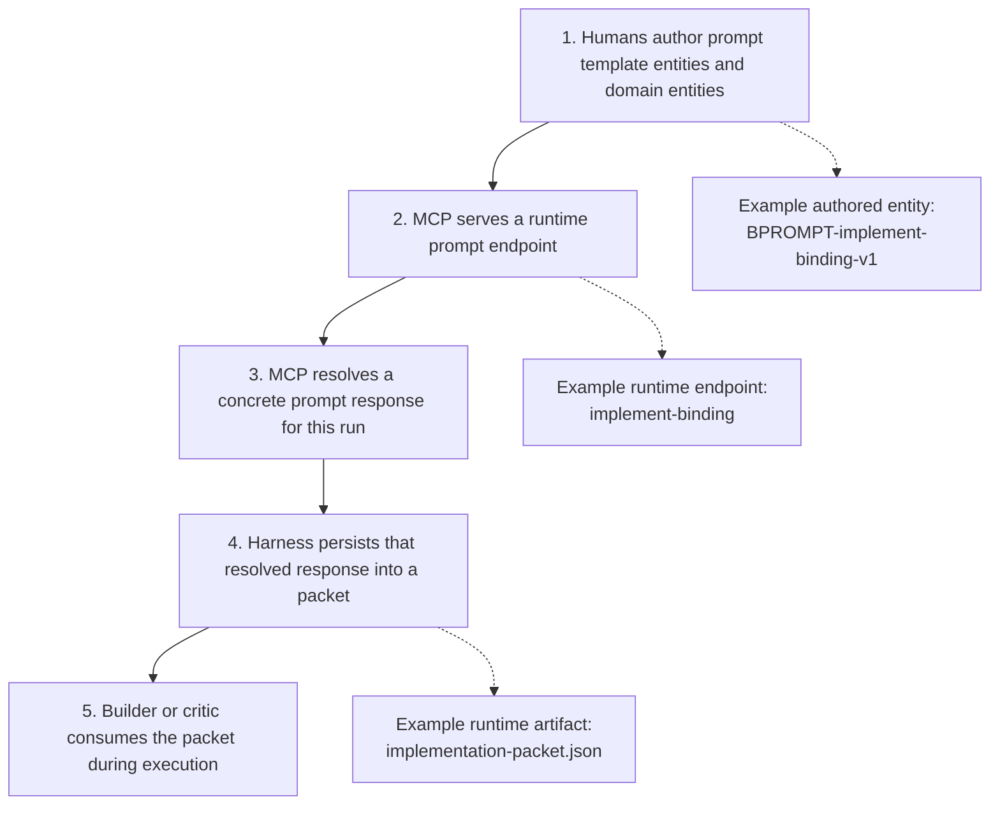
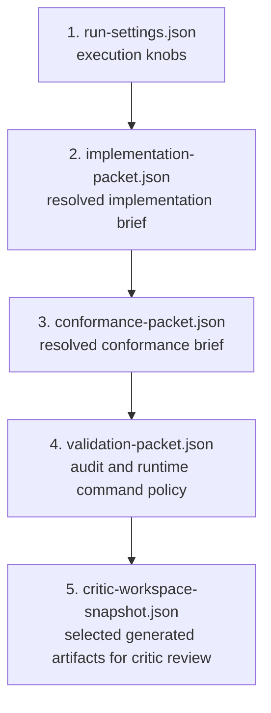
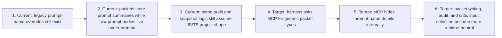

# Spec Generation Harness Flow

Status: Working reference
Parent documents:
- [docs/spec-driven-implementation-bindings.md](./spec-driven-implementation-bindings.md)
- [docs/spec-generation-harness-next-architecture.md](./spec-generation-harness-next-architecture.md)

This document explains the current spec-driven generation flow in human terms.

It is meant to be readable on its own.

You should be able to answer these questions from this document alone:
- where does the implementation guidance come from
- what the harness actually does
- what is frozen and why
- what the builder model sees
- what the critic model sees
- what the packets are
- where domain knowledge lives versus where generic orchestration lives

## Terms Used In This Document

### Authored layer

When this document says **authored layer**, it means:
- the things humans intentionally modeled and committed to the repo
- the durable source-of-truth artifacts
- the specification content that exists before a run starts

Examples:
- validation rules
- test vectors
- error codes
- runtime profiles
- implementation bindings
- prompt template entities

This is different from **runtime artifacts**, which are generated during a harness run.

### Runtime artifact

A **runtime artifact** is anything created during a specific run.

Examples:
- a resolved prompt text
- a packet JSON file
- a generated `src/validator.ts`
- an audit report
- a critic report

Runtime artifacts are evidence.
They are not the authoritative domain model.

### Packet

A **packet** in this repo is just a structured run artifact written by the harness.

It is not an MCP protocol packet.
It is not a metamodel entity.
It is a persisted bundle of run context, used so the builder and critic can inspect the same evidence later.

Examples:
- `packets/run-settings.json`
- `packets/implementation-packet.json`
- `packets/conformance-packet.json`
- `packets/validation-packet.json`
- `packets/critic-workspace-snapshot.json`

## The Big Idea

The workflow is trying to do three things at once:

1. keep domain semantics in the authored bundle layer
2. keep the harness generic and evidence-oriented
3. still let models act autonomously enough to generate and validate code

So the intended split is:
- humans author the domain model
- MCP resolves the relevant context for a particular run
- the harness packages that context, executes phases, and records evidence
- the builder generates code
- the machine audit checks deterministic things
- the critic reviews semantic fidelity

If that split is done well:
- the harness does not need JWT-specific business logic
- the builder does not need to guess the contract from vague prose
- the critic can replay and inspect the exact same run later

## 0. User-Facing Workflow: Conversation To Delivery

This section explains the workflow from the perspective of:
- a user in the broad sense

Here, **user** can mean many different roles:
- product owner
- business stakeholder
- domain expert
- analyst
- architect
- engineer

The important point is not the job title.
The important point is that only users or agents with the right permissions should be able to change the Domain Layer through MCP-mediated edits.

The key idea is that the technical harness run is **not** the beginning of the workflow.

Before the harness starts, there is usually an interactive domain-shaping phase:
- the user explains the desired capability
- AI maps that intent onto the Domain Layer
- if the Domain Layer is incomplete, AI and the user tighten it
- only when the Domain Layer is implementation-ready does the delivery chain start

That means the real end-to-end workflow is:
- conversation
- domain resolution and completion
- deliverable spec packet
- implementation
- execution and validation

### User-Level Flow



### Why This Matters

This is the most important user-facing rule in the whole workflow:

**implementation should not begin until the Domain Layer is implementation-ready**

Here, **implementation-ready** means:
- internally consistent
- explicit enough to avoid guesswork on important behavior
- constrained enough to produce one concrete deliverable run context
- executable through the delivery chain without semantic gaps that force the model to improvise

If the Domain Layer is still missing essential semantics, the right move is not:
- “let the model guess”

The right move is:
- “go back and strengthen the Domain Layer”

That is why the workflow includes a loop before implementation.

### User-Level Sequence



### Plain-English Explanation

A good way to think about this is:

1. The user talks about the business or product problem.
2. The AI agent, using an MCP client under the hood, tries to express that problem in the repository’s Domain Layer.
3. If the modeled layer is not implementation-ready yet, AI and the user refine it through MCP-mediated domain-layer changes.
4. Once the modeled language is implementation-ready, the system can resolve one concrete implementation packet.
5. Only then does the harness move into code generation and verification.

So the harness is **not** the thing that figures out what the product should do.

The harness is the thing that executes a deliverable specification after the Domain Layer is already good enough.

### Sequence Step Walkthrough

<details>
<summary><strong>Step 1. User describes desired capability</strong></summary>

This is the business or product intent entering the system.

The user is not expected to speak in schema names or entity IDs.
They are expressing what they want, what should happen, what must not happen, and what matters.

Examples:
- a new behavior
- a new constraint
- a policy clarification
- a new runtime target
- a changed expected outcome for an edge case
</details>

<details>
<summary><strong>Step 2. AI agent reads current domain-layer context</strong></summary>

The AI agent does not guess what already exists.
Under the hood, it uses an MCP client to ask the MCP server for the current state that matters to the conversation.

This usually means reading:
- existing requirements
- existing rules
- existing vectors
- existing contracts
- existing bindings

The purpose of this step is to ground the conversation in what is already modeled.
</details>

<details>
<summary><strong>Step 3. MCP server reads the current domain-layer state</strong></summary>

The MCP server is the controlled entry point to the Domain Layer.

It reads the current modeled state and returns:
- what already exists
- what relationships already connect
- where gaps or inconsistencies appear

This is why the MCP server sits in front of the Domain Layer in the sequence.
The AI agent does not mutate the Domain Layer directly.
</details>

<details>
<summary><strong>Step 4. AI evaluates whether the Domain Layer is implementation-ready</strong></summary>

This is the first go/no-go check.

The question is not just:
- “do we have some entities?”

The real question is:
- “is the Domain Layer implementation-ready?”

That means:
- the modeled semantics make sense together
- the important behaviors are explicit
- the critical edge cases are not left to guesswork
- the constraints are strong enough to produce one concrete delivery target
- the delivery chain could execute without the builder inventing missing semantics
</details>

<details>
<summary><strong>Step 5. AI explains gaps or ambiguities back to the user</strong></summary>

If the Domain Layer is not implementation-ready, AI should explain why.

Typical examples:
- a rule is missing
- an error outcome is ambiguous
- a vector is missing for an important edge case
- the contract is too vague to implement safely
- the runtime binding is underspecified

This is the point where the user can refine intent before implementation starts.
</details>

<details>
<summary><strong>Step 6. User clarifies behavior, policy, outcomes, or edge cases</strong></summary>

This is the interactive completion loop.

The user may provide:
- business clarifications
- expected behavior
- forbidden behavior
- examples
- negative cases
- runtime preferences

The purpose is to close the semantic gap in the Domain Layer before delivery begins.
</details>

<details>
<summary><strong>Step 7. AI calls <code>apply_changes</code></strong></summary>

This is the explicit modeling step.

AI uses MCP `apply_changes` to refine the Domain Layer by changing things like:
- requirements
- rules
- vectors
- contracts
- bindings
- supporting context

This is how conversational intent becomes durable modeled semantics.
</details>

<details>
<summary><strong>Step 8. MCP server persists domain-layer changes and returns updated state</strong></summary>

This is the commit point for the modeling phase.

The MCP server:
- validates and applies the requested changes
- persists them into the Domain Layer
- returns the updated state to the client

So “updated domain-layer state” simply means:
- the authoritative modeled state after the latest accepted changes

It is not a vague runtime status.
It is the latest persisted specification state.
</details>

<details>
<summary><strong>Step 9. AI confirms the Domain Layer is implementation-ready</strong></summary>

This is the go signal.

AI should only give this signal when the Domain Layer is coherent enough that a harness run can now be resolved and executed without forcing the builder to invent missing semantics.

That is why “implementation-ready” is stronger than “good enough.”
</details>

<details>
<summary><strong>Step 10. Resolve one concrete deliverable context</strong></summary>

Now the system narrows the Domain Layer to one actual delivery target.

Examples:
- one operation
- one binding
- one conformance suite
- one artifact mode

This is where abstract modeled knowledge becomes one concrete implementation brief.
</details>

<details>
<summary><strong>Step 11. Start the harness and delivery chain</strong></summary>

Only now does the technical delivery flow begin.

The harness:
- freezes packets
- freezes normative tests
- runs builder, audit, and critic phases
- returns delivery evidence

So the harness is downstream of modeling.
It is not the mechanism that decides what the product should mean.
</details>

### User-Level Step Breakdown

<details>
<summary><strong>1. User describes the desired capability</strong></summary>

This is the conversational phase.

Examples:
- “I want JWT validation with exact trust semantics.”
- “I want a Python version of the same validator.”
- “I want a library, not a framework integration.”
- “I need this error case to be treated as malformed, not rejected.”

At this point, the request is still intent.
It is not yet guaranteed to be implementable.
</details>

<details>
<summary><strong>2. AI maps the request onto the Domain Layer</strong></summary>

AI checks whether the current Domain Layer already expresses the request.

That means looking for things like:
- relevant operations
- relevant runtime bindings
- relevant requirements and rules
- relevant error codes
- relevant test vectors
- relevant output contracts

If they already exist and are implementation-ready, great.
If they exist but are vague or incomplete, the workflow should not jump to implementation yet.
</details>

<details>
<summary><strong>3. Domain Layer completion loop</strong></summary>

This is the loop you were calling out.

It is interactive and may take multiple passes.

Typical reasons to loop:
- required behavior is not modeled yet
- error semantics are ambiguous
- edge cases are missing
- conformance vectors are insufficient
- runtime/binding constraints are underspecified
- output contract is unclear

This loop ends only when AI can say:

“The Domain Layer is implementation-ready: internally consistent, explicit enough, and executable as a deliverable implementation context.”

That is the go/no-go gate before implementation.
</details>

<details>
<summary><strong>4. Resolve a deliverable run context</strong></summary>

Once the Domain Layer is implementation-ready, the system narrows it to one concrete delivery target.

Examples:
- one binding
- one operation
- one conformance suite
- one artifact mode

This is the point where abstract domain modeling turns into an implementation-ready run.
</details>

<details>
<summary><strong>5. Harness freezes the resolved spec</strong></summary>

The harness writes:
- packets
- frozen normative tests
- run settings

This is how the resolved specification becomes a stable execution input.

From this point on, the builder is not supposed to re-negotiate the contract.
It is supposed to implement it.
</details>

<details>
<summary><strong>6. Delivery chain executes</strong></summary>

Now the technical chain starts:
- builder writes code
- machine audit checks deterministic behavior
- critic reviews semantic fidelity

If this fails because implementation is wrong, we repair implementation.

If this fails because the contract itself was still incomplete, we go back to the domain-layer completion loop and strengthen the model.
</details>

## 1. High-Level Flow

This is the whole story in one diagram.



### High-Level Explanation

The important thing to notice is that the run does not start from a single free-form prompt.

Instead it starts from:
- authored domain entities
- MCP resolution
- packet persistence
- frozen tests

That is the core shift-left idea.

The builder is not supposed to invent the contract.
It is supposed to implement against a contract that was already modeled and resolved.

That leads to an important architectural split:
- MCP is used during the **resolution phase**
- the builder can often work from frozen local artifacts during the **implementation phase**

Why that split exists:
- before implementation, the system still needs MCP to answer domain questions such as which binding, suite, rules, vectors, and contracts apply
- after the harness has already written packets and frozen tests, those answers are no longer implicit or live; they are local run artifacts

So once the run already contains:
- `implementation-packet.json`
- `conformance-packet.json`
- `validation-packet.json`
- frozen normative tests

the builder often does not need live MCP access anymore.

At that point, the builder already has:
- the resolved specification for this run
- the required contracts
- the normative test corpus
- the acceptance context

That is why a packet-driven implementation phase is attractive:
- it reduces repeated lookups
- it reduces model wandering
- it makes the run more reproducible
- it makes builder comparisons fairer because they see the same frozen local inputs

### Step-By-Step Breakdown

<details>
<summary><strong>1. Humans author bundle entities</strong></summary>

This is the durable source of truth.

In practical terms, this means a person or team has already modeled things like:
- what counts as a valid token
- what failure modes exist
- which errors must be emitted
- which runtime/library family a binding targets
- which conformance vectors prove the implementation

This is why the workflow is called spec-driven.
The run should begin from modeled semantics, not from a blank prompt.

Examples of authored things:
- a `ValidationRule` entity that says a claim is required
- a `TestVector` entity that says a token must fail with `ERR-missing-claim`
- a `RuntimeProfile` that says the runtime is Node.js 22 with `pnpm`
- a `DependencyPolicy` that says use `jose` 5.x

These are the things that should be reviewed and maintained as the contract.
</details>

<details>
<summary><strong>2. MCP resolves the relevant run context</strong></summary>

The MCP server takes the authored bundle layer and narrows it down for one concrete run.

For example, a run may say:
- bundle: `jwt`
- binding: `BIND-node-jose-library`
- operation: `OP-validate-jwt`
- suite: `SUITE-core-validation`

MCP then resolves the concrete context the model needs.

Today this still flows mainly through prompt endpoints such as:
- `implement-binding`
- `generate-binding-tests`

That means MCP is doing resolution work such as:
- reading the selected binding entity
- reading the selected operation
- pulling the runtime profile
- pulling the dependency policy
- assembling the relevant vectors
- rendering a resolved prompt response

Important:
- the authored prompt template entity is part of the authored layer
- the resolved prompt text is a runtime artifact
</details>

<details>
<summary><strong>3. Harness creates a new run directory</strong></summary>

Each run gets its own isolated evidence folder under `.scratch/binding-runs/`.

That folder is the execution envelope for the run.

It contains:
- prompts
- packets
- generated files
- logs
- audit outputs
- critic outputs

This isolation matters because it makes runs:
- replayable
- inspectable
- comparable
- disposable

If a run goes wrong, you can inspect exactly what happened without guessing which prompt, code, or report belonged to which attempt.
</details>

<details>
<summary><strong>4. Harness writes packets that preserve the resolved context</strong></summary>

Packets are how the harness turns live resolution into persistent evidence.

The harness is essentially saying:

“Here is exactly what this run was told, exactly what validation policy was used, and exactly what the critic should later inspect.”

That is why packets are valuable:
- they reduce hidden context
- they let the critic replay a run without regeneration
- they let humans inspect what the builder actually received

At this stage the harness is not supposed to invent JWT semantics.
It is supposed to persist the already-resolved run context.

This is also the point of packets.

Packets are not just logs.
They are the bridge between:
- live domain resolution through MCP
- local, frozen implementation inputs for the builder and critic

Without packets, the builder would depend on hidden live context.
With packets, the run carries its own resolved specification.
</details>

<details>
<summary><strong>5. Harness generates and freezes the normative test pack</strong></summary>

This is one of the most important steps.

The conformance pack is generated before implementation and then frozen.

Why freeze it:
- so the builder cannot weaken it later
- so the machine audit can detect mutation
- so the run has a stable notion of what “passing” means

This is the main difference between:
- vague code generation
- spec-driven code generation

The tests are not an afterthought.
They are part of the contract that gets frozen before coding.

Today the harness still materializes these tests from local template packs under
`scripts/binding-harness-templates/`, but the selection is now declared in
each pack manifest instead of being hardcoded as one exact runtime triple.

That means a pack can say, in data:
- which binding languages it supports
- which runtime names or package managers it supports
- which tags or toolchains it is compatible with

The harness then picks the best matching pack and records the chosen `packId`
in `logs/frozen-test-generator.log`.

The pack manifest also declares any required directories and output files.
So the harness no longer assumes a fixed `tests/fixtures/` layout in code.
It creates whatever directories the selected pack says it needs.

Template replacements are also becoming more declarative.
Instead of a hardcoded replacement enum, the pack now declares named context
entries and then references those names from replacements.
So the pack can choose names like:
- `jwtFixtureMap`
- `conformanceVectors`
- `selectedSuiteId`

The harness materializes those declared entries and fails fast if a pack
requests a source name that does not exist.

The shape of `fixtureMap` and `normalizedVectors` is also moving into pack
metadata. So the manifest can declare:
- which fixture fields should be preserved
- which vector fields should be preserved
- which defaults should be applied
- which simple derived fields should be added

That keeps the frozen test input shape closer to pack data and less buried in
the harness implementation.

Template references are now pack-local as well. A manifest points to files
relative to its own directory instead of knowing the global `scripts/binding-harness-templates/...`
layout. That keeps the pack more self-contained.

For very small artifacts, the manifest can also carry an inline template
directly. That reduces the need for one-file-per-template when the artifact is
small and tightly coupled to the pack.
</details>

<details>
<summary><strong>6. Builder model writes or repairs the implementation workspace</strong></summary>

The builder is the generation model.

Depending on mode:
- in `generate-only`, it mostly writes artifacts
- in `self-verify`, it can also run a compact red/green loop inside the generated workspace

The builder can create:
- source code
- docs
- configs
- example files
- mutable test artifacts if the workflow allows them

But it should not:
- redefine the contract
- change frozen tests
- invent new domain semantics that were not modeled

This is the phase where the resolution/implementation split matters most.

If packets and frozen tests already exist, the builder usually does not need to ask MCP anything new.
It can just implement from the local run artifacts.

That is the intended model:
- MCP resolves
- harness freezes
- builder implements

In other words, the builder is not supposed to keep rediscovering the domain model live.
It is supposed to work from the already-resolved contract for this run.
</details>

<details>
<summary><strong>7. Harness runs deterministic machine audit checks</strong></summary>

After the builder stops, the harness runs generic, mechanical checks.

These are not supposed to be the domain brain.
They are supposed to be the neutral referee for things like:
- were files generated at all
- were frozen assets mutated
- did install/build/test succeed
- how many vectors passed or failed

This is the “outer guardrail” layer.
</details>

<details>
<summary><strong>8. Critic model reviews packets, audit evidence, and optionally selected files</strong></summary>

The critic is the semantic reviewer.

The current intended pattern is:
- shallow packet-only review first
- deep file inspection only if something looks suspicious
- if the critic explores but does not finish, resume the same session and force a final verdict

The critic should act more like a reviewer than a builder.

That means:
- bounded
- evidence-first
- structured output
- read-only
</details>

<details>
<summary><strong>9. Harness writes final reports for replay and review</strong></summary>

At the end, the run becomes a bundle of evidence.

Important artifacts include:
- machine audit report
- semantic audit report
- critic report
- generated workspace
- packets

That is what makes the workflow inspectable after the fact.
</details>

## 2. Builder Path In Detail

This is the builder flow with explicit sequencing.



### What The Builder Actually Receives

The builder does not receive only one tiny prompt.
It receives a run workspace with a lot of explicit context already present.

That includes:
- resolved prompt text
- implementation packet
- conformance packet
- frozen tests
- run settings

So if you ask “what exactly was the builder told?”, the answer is:
- inspect the resolved prompt
- inspect the implementation packet
- inspect the conformance packet
- inspect the generated frozen tests

This is also why the builder may not need live MCP access during implementation.

By the time the builder starts writing code, the harness has already done the domain-resolution work.
The run directory already contains the resolved specification inputs in local form.

So the clean separation is:
- MCP answers domain questions before implementation
- packets preserve those answers
- the builder implements from the preserved answers

That means “no MCP during implementation” is not a loss of specification context.
It is just a different delivery mechanism for the same context.

### Builder Step Breakdown

<details>
<summary><strong>Builder step 1. Resolve implementation context</strong></summary>

This is where the builder-specific brief comes from.

A concrete example is:
- binding: `BIND-node-jose-library`
- operation: `OP-validate-jwt`

MCP resolves:
- the implementation binding
- the runtime profile
- the dependency policy
- the output contract
- the selected operation
- the relevant profiles, rules, and vectors

This gets persisted into:
- [implementation-packet.json](/home/ivan/dev/sdd-bundle-editor/.scratch/binding-runs/2026-03-31T08-19-01-399Z-BIND-node-jose-library/packets/implementation-packet.json)

Example of the sort of resolved content inside that packet:

```json
{
  "kind": "implementation-packet",
  "bundleId": "jwt",
  "bindingId": "BIND-node-jose-library",
  "operationId": "OP-validate-jwt",
  "artifactMode": "library-only",
  "promptName": "implement-binding"
}
```

That packet then also contains the resolved prompt response body.
</details>

<details>
<summary><strong>Builder step 2. Resolve conformance context</strong></summary>

This is the testing side of the same story.

MCP resolves:
- selected suite
- selected vectors
- fixture references
- test guidance
- frozen-test policy

This gets persisted into:
- [conformance-packet.json](/home/ivan/dev/sdd-bundle-editor/.scratch/binding-runs/2026-03-31T08-19-01-399Z-BIND-node-jose-library/packets/conformance-packet.json)

Small example:

```json
{
  "kind": "conformance-packet",
  "bundleId": "jwt",
  "bindingId": "BIND-node-jose-library",
  "suiteId": "SUITE-core-validation",
  "freezeTests": true
}
```
</details>

<details>
<summary><strong>Builder step 3. Write packets to the run directory</strong></summary>

The harness writes packet files so the run becomes inspectable.

The main packet set today is:
- `run-settings.json`
- `implementation-packet.json`
- `conformance-packet.json`
- `validation-packet.json`

Example from the current run:

```json
{
  "bundleId": "jwt",
  "bindingId": "BIND-node-jose-library",
  "operationId": "OP-validate-jwt",
  "suiteId": "SUITE-core-validation",
  "mode": "self-verify",
  "model": "gemini-3-flash-preview",
  "criticModel": "gpt-5.2"
}
```

That is from:
- [run-settings.json](/home/ivan/dev/sdd-bundle-editor/.scratch/binding-runs/2026-03-31T08-19-01-399Z-BIND-node-jose-library/packets/run-settings.json)
</details>

<details>
<summary><strong>Builder step 4. Materialize and freeze normative tests</strong></summary>

The harness now generates the deterministic test pack before the builder gets to change anything.

That frozen pack is tracked by a manifest.

Example:

```json
[
  {
    "path": "tests/conformance.test.ts",
    "sha256": "..."
  },
  {
    "path": "tests/fixtures/vectors.ts",
    "sha256": "..."
  }
]
```

That manifest is written to:
- [frozen-test-manifest.json](/home/ivan/dev/sdd-bundle-editor/.scratch/binding-runs/2026-03-31T08-19-01-399Z-BIND-node-jose-library/frozen-test-manifest.json)
</details>

<details>
<summary><strong>Builder step 5. Start builder phase with run context</strong></summary>

At this point the builder is launched.

What the harness is effectively saying is:

“Use the resolved implementation context, keep the frozen tests intact, and produce a workspace that satisfies the modeled contract.”

This is where model choice matters.

Current policy:
- faster builder
- stronger critic

Another important point:

At this stage the builder does not necessarily need live access to the MCP server anymore.
If the packets and frozen tests are complete, the builder can implement from local artifacts alone.

That is often preferable because it prevents the builder from spending time re-querying domain context that the harness already resolved and froze for this run.
</details>

<details>
<summary><strong>Builder step 6. Write source, config, docs, and support artifacts</strong></summary>

The builder writes into the generated workspace.

For the current pilot, that typically includes:
- `src/index.ts`
- `src/types.ts`
- `src/validator.ts`
- `tests/conformance.test.ts`
- `README.md`
- `binding-manifest.json`

The generated workspace for the fresh run is here:
- [generated](/home/ivan/dev/sdd-bundle-editor/.scratch/binding-runs/2026-03-31T08-19-01-399Z-BIND-node-jose-library/generated)
</details>

<details>
<summary><strong>Builder step 7. Optional self-verify loop</strong></summary>

Only in `self-verify`.

The builder can run commands such as install and test in the generated workspace and then repair code based on failures.

This inner loop is useful for:
- library API mismatches
- compile errors
- runtime wiring issues

But the builder still does not get final authority.
The outer harness audit is the acceptance gate.
</details>

## 3. Machine Audit In Detail

This is the deterministic, non-LLM guardrail path.



### Machine-Audit Explanation

This layer should stay boring.

That is a feature, not a problem.

The machine audit is meant to answer:
- did the run produce usable files
- did it mutate frozen assets
- did the chosen runtime commands succeed
- what happened against the modeled vectors

It is not meant to guess domain intent from prose.

### Audit Step Breakdown

<details>
<summary><strong>Audit step 1. Read generated workspace</strong></summary>

The harness scans the generated directory and prepares the artifact set for later checks.

This is also the basis for later critic integrity checking.
</details>

<details>
<summary><strong>Audit step 2. Check generated-files-present</strong></summary>

This answers a simple first question:

Did the builder actually produce a non-trivial workspace?

This protects against runs that technically “completed” but generated almost nothing useful.
</details>

<details>
<summary><strong>Audit step 3. Check frozen-test-integrity</strong></summary>

This compares the current test artifacts against the frozen manifest hashes.

If the model altered a frozen test file, this should fail immediately.

This is the core anti-cheating guardrail.
</details>

<details>
<summary><strong>Audit step 4. Check vector-coverage</strong></summary>

This asks whether the modeled vectors are still represented and exercised.

The exact extraction logic is still somewhat transitional today, but the purpose is clear:
- do not let a run silently omit parts of the conformance corpus
</details>

<details>
<summary><strong>Audit step 5. Check placeholder-scan</strong></summary>

This catches obviously incomplete outputs, for example:
- TODO markers
- prose-plan leftovers
- template placeholders

It is a cheap quality floor.
</details>

<details>
<summary><strong>Audit step 6. Run runtime install/build/test commands</strong></summary>

This no longer hardcodes `npm`.

The runtime command policy is derived from the selected runtime profile and persisted in the packets.

Example from the current run:

```json
{
  "packageManager": "pnpm",
  "installCommand": "pnpm install",
  "testCommand": "pnpm test",
  "buildCommand": "pnpm build"
}
```

This comes from:
- [run-settings.json](/home/ivan/dev/sdd-bundle-editor/.scratch/binding-runs/2026-03-31T08-19-01-399Z-BIND-node-jose-library/packets/run-settings.json)

The harness then uses those commands for the outer audit.

If a runtime-specific build command exists, the harness prefers that for the outer static/build check.
Only if no explicit build command is available and a `tsconfig.json` is present does it fall back to a TypeScript compiler validation path.
</details>

<details>
<summary><strong>Audit step 7. Compute semantic audit from observed test evidence</strong></summary>

This is the machine-readable semantic summary.

It reports:
- total vectors seen
- failing vectors
- mismatch categories

Example from the fresh green run:

```json
{
  "status": "passed",
  "totalVectors": 24,
  "failingVectors": 0,
  "mismatches": []
}
```

That is here:
- [semantic-report.json](/home/ivan/dev/sdd-bundle-editor/.scratch/binding-runs/2026-03-31T08-19-01-399Z-BIND-node-jose-library/audit/semantic-report.json)
</details>

<details>
<summary><strong>Audit step 8. Write audit outputs</strong></summary>

The audit outputs are durable run artifacts.

Examples:
- [audit/report.json](/home/ivan/dev/sdd-bundle-editor/.scratch/binding-runs/2026-03-31T08-19-01-399Z-BIND-node-jose-library/audit/report.json)
- [audit/semantic-report.json](/home/ivan/dev/sdd-bundle-editor/.scratch/binding-runs/2026-03-31T08-19-01-399Z-BIND-node-jose-library/audit/semantic-report.json)

These files are what the critic reads first.
</details>

## 4. Critic Path In Detail

The critic is the semantic reviewer, not the primary builder.



### Critic Explanation

The critic is intentionally separated from the builder because these are different jobs.

The builder is optimized for:
- creation
- repair
- momentum

The critic is optimized for:
- review
- skepticism
- semantic fidelity

That is why the current preferred split is:
- faster builder
- stronger critic

### Critic Step Breakdown

<details>
<summary><strong>Critic step 1. Start shallow review</strong></summary>

This is now the default entry point.

The critic should begin by assuming:
- if machine audit is green
- and semantic audit is green
- and packets look coherent

then it should not go spelunking through the entire generated workspace.
</details>

<details>
<summary><strong>Critic step 2. Read packets and audit artifacts only</strong></summary>

The shallow critic starts from these artifacts:
- `packets/run-settings.json`
- `packets/validation-packet.json`
- `packets/implementation-packet.json`
- `packets/conformance-packet.json`
- `audit/report.json`
- `audit/semantic-report.json`

The purpose is to make the default critic path:
- narrow
- cheap
- explainable
- replayable
</details>

<details>
<summary><strong>Critic step 3. Return pass/fail/defer or justify anomaly</strong></summary>

The shallow critic should do one of three things:

1. `pass`
If the evidence is coherent and green.

2. `fail`
If the packets or audit evidence already show something clearly wrong.

3. `defer`
If it can justify why deeper inspection is needed.

The key change is that it should not silently convert “maybe” into ten minutes of aimless exploration.
</details>

<details>
<summary><strong>Critic step 4. Start deep review</strong></summary>

Deep review is anomaly-triggered.

This means the critic can inspect selected generated files, but only when it has a reason.

Examples of a justified escalation:
- semantic mismatches exist
- machine audit failed
- a packet suggests a contract mismatch
- a shallow finding needs direct file evidence
</details>

<details>
<summary><strong>Critic step 5. Resume same session with finish-now prompt</strong></summary>

If the critic explored but did not emit the final structured verdict, the harness resumes the same session instead of starting over.

Why this is useful:
- the critic already has the reviewed context in memory
- a finish-now prompt is cheaper than a fresh run
- it reduces repeated exploration

This is especially valuable for Codex-style critics that can over-explore if left unconstrained.
</details>

<details>
<summary><strong>Critic step 6. Write critic-report.json</strong></summary>

The critic report becomes another durable run artifact.

That is what lets us do:
- `critic-only` replay
- post-run inspection
- debugging of critic behavior

When the critic-only replay worked on the green run, it produced:
- [critic-only-report.json](/home/ivan/dev/sdd-bundle-editor/.scratch/binding-runs/2026-03-31T08-19-01-399Z-BIND-node-jose-library/critic-only-report.json)
</details>

## 5. Where The Text Actually Comes From

This is the part that tends to be confusing, so here it is explicitly.



### Plain-English Explanation

There are three different things here, and mixing them up causes confusion.

#### 1. Authored prompt template entity

This is modeled and stored in the bundle.

Example:
- `BPROMPT-implement-binding-v1`

This belongs to the authored layer.

#### 2. Runtime MCP prompt endpoint

This is the served entrypoint name the harness asks for.

Example:
- `implement-binding`

This is not itself a metamodel entity.
It is a runtime serving convention.

#### 3. Resolved prompt response

This is the actual text returned for one concrete run after MCP has assembled the context.

This is what gets persisted into:
- [implementation-packet.json](/home/ivan/dev/sdd-bundle-editor/.scratch/binding-runs/2026-03-31T08-19-01-399Z-BIND-node-jose-library/packets/implementation-packet.json)

So when you open that packet and see a huge body of text, that is:
- not the authored prompt template itself
- not a metamodel entity
- but a runtime artifact produced by MCP resolution

### Step Breakdown With Concrete Examples

<details>
<summary><strong>Text step 1. Humans author prompt template entities and domain entities</strong></summary>

This is where the reusable prompt template lives.

Example:
- a bundle may contain `BPROMPT-implement-binding-v1`

The same authored layer also contains:
- rules
- vectors
- bindings
- runtime profiles

These authored things exist before any run begins.
</details>

<details>
<summary><strong>Text step 2. MCP serves a runtime prompt endpoint</strong></summary>

At runtime, the harness does not directly ask for the entity ID.

Instead it calls an MCP prompt endpoint such as:
- `implement-binding`
- `generate-binding-tests`

That is why the harness still currently “knows” prompt names.
</details>

<details>
<summary><strong>Text step 3. MCP resolves a concrete prompt response for this run</strong></summary>

MCP combines:
- the prompt template entity
- the selected binding
- the selected operation
- the suite
- the referenced vectors and policies

The result is a concrete resolved prompt body for this one run.
</details>

<details>
<summary><strong>Text step 4. Harness persists packet summaries plus raw-prompt references</strong></summary>

The harness writes summary-oriented packet files and keeps the raw prompt payloads under `prompt/`.

That is why you see domain-specific content in:
- [implementation-packet.json](/home/ivan/dev/sdd-bundle-editor/.scratch/binding-runs/2026-03-31T08-19-01-399Z-BIND-node-jose-library/packets/implementation-packet.json)

That content is domain-specific because the selected run is domain-specific.

That does not automatically mean the harness is leaking domain logic.
It may just be persisting the already-resolved truth in a smaller replay-oriented form.
</details>

<details>
<summary><strong>Text step 5. Builder or critic consumes the packet during execution</strong></summary>

This is what makes runs replayable.

It is why a later `critic-only` pass can inspect the same evidence without regenerating the implementation.
</details>

## 6. Packet Inventory

Here is what each packet is for in plain language.



<details>
<summary><strong>Packet 1. run-settings.json</strong></summary>

This is the run configuration record.

It answers:
- which bundle
- which binding
- which operation
- which suite
- which builder model
- which critic model
- which mode
- which runtime command policy

Example:

```json
{
  "bundleId": "jwt",
  "bindingId": "BIND-node-jose-library",
  "operationId": "OP-validate-jwt",
  "suiteId": "SUITE-core-validation",
  "mode": "self-verify",
  "model": "gemini-3-flash-preview",
  "criticModel": "gpt-5.2",
  "runtimeCommandPolicy": {
    "packageManager": "pnpm",
    "installCommand": "pnpm install",
    "testCommand": "pnpm test"
  }
}
```
</details>

<details>
<summary><strong>Packet 2. implementation-packet.json</strong></summary>

This is the resolved implementation context.

It usually contains:
- run identity
- prompt name
- prompt summary
- prompt artifact references
- selected binding/operation info

This is the packet that most directly tells you what the builder was asked to implement.
</details>

<details>
<summary><strong>Packet 3. conformance-packet.json</strong></summary>

This is the resolved conformance context.

It usually contains:
- selected suite
- test prompt summary
- prompt artifact references
- frozen-test policy
- frozen manifest

This is the packet that most directly tells you what conformance baseline the builder had to satisfy.
</details>

<details>
<summary><strong>Packet 4. validation-packet.json</strong></summary>

This is the outer-audit packet.

It contains things like:
- execution policy
- generic mechanical check names
- runtime command policy

Its purpose is not to restate the whole domain model.
Its purpose is to say how this run should be validated mechanically.
</details>

<details>
<summary><strong>Packet 5. critic-workspace-snapshot.json</strong></summary>

This is a selected view of the generated workspace prepared for critic review.

It exists so the critic does not always need to walk the whole generated directory tree.

It now ignores common cache/build artifacts and prefers runtime-relevant manifests plus source, test, example, and documentation files.

It is still partly shaped by current project conventions, so it remains part of the generalization work.
</details>

## 7. Current Vs Target Direction

This is the cleanup roadmap in one diagram.



<details>
<summary><strong>Target step 4. Harness asks MCP for generic packet types</strong></summary>

Today the default path already asks MCP for packet types, but the harness still keeps legacy prompt-name overrides for fallback and debugging.

Older direct prompt names were:
- `implement-binding`
- `generate-binding-tests`

The cleaner target is for the harness to rely only on things like:
- implementation packet
- conformance packet
- validation packet

and let MCP decide internally how those are assembled.
</details>

<details>
<summary><strong>Target step 5. MCP hides prompt-name details internally</strong></summary>

This reduces leakage of runtime serving conventions into the harness.

The harness should care about:
- packet types
- execution modes
- evidence persistence

not about internal prompt plumbing.
</details>

<details>
<summary><strong>Target step 6. Packet writing, audit, and critic input selection become more runtime-neutral</strong></summary>

This is the remaining generalization work.

Examples:
- reduce Node/TypeScript bias in critic snapshot selection
- rename checks that are too language-specific
- derive more selection logic from runtime profile and output contract data

The important thing is that this should be done without moving domain logic into the harness.
</details>

## Recommended Reading Order

If you want the shortest path to understanding:
1. High-level flow
2. Builder path
3. Machine audit
4. Critic path
5. Where the text actually comes from
6. Packet inventory

That sequence should let you understand the run without opening five other documents first.
